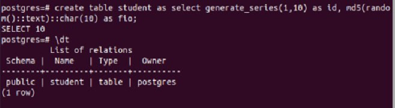
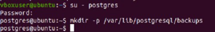
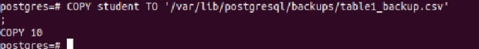
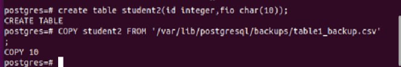
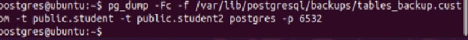
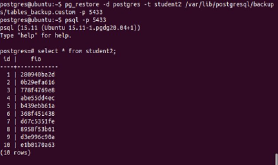

### Создаем ВМ/докер c ПГ. Создаем БД, схему и в ней таблицу.

### Заполним таблицы автосгенерированными 100 записями. Под линукс пользователем Postgres создадим каталог для бэкапов

### Сделаем логический бэкап используя утилиту COPY

### Восстановим в 2 таблицу данные из бэкапа.

### Используя утилиту pg_dump создадим бэкап в кастомном сжатом формате двух таблиц

### Используя утилиту pg_restore восстановим в новую БД только вторую таблицу!

