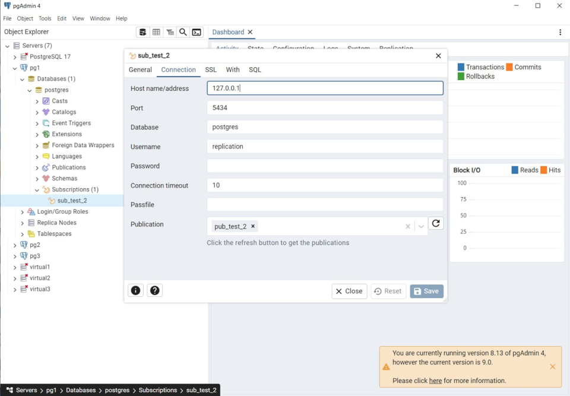

Поднял 3 виртуалки 

### На 1 ВМ создаем таблицы test для записи, test2 для запросов на чтение. Создаем публикацию таблицы test и подписываемся на публикацию таблицы test2 с ВМ №2.
Подписка с 1 ВМ на 2 ВМ

Публикация на 1 ВМ

### На 2 ВМ создаем таблицы test2 для записи, test для запросов на чтение. Создаем публикацию таблицы test2 и подписываемся на публикацию таблицы test1 с ВМ №1.

Публикация на 2 ВМ

Подписка со 2 ВМ на 1 ВМ

### 3 ВМ использовать как реплику для чтения и бэкапов (подписаться на таблицы из ВМ №1 и №2 ).
На 3 ВМ подписался на таблицу из ВМ1

На 3 ВМ подписался на таблицу из ВМ2

### Тестирование

Вставили в 1 ВМ

Доехало на 2 ВМ

На третью тоже

Вставялем во 2 ВМ

Доехало на 3

Доехало на 1
