### Cоздайте новый кластер PostgresSQL 14
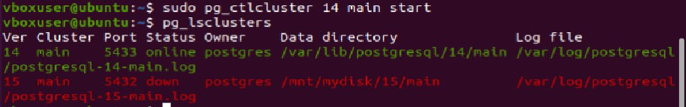
### зайдите в созданный кластер под пользователем postgres создайте новую базу данных testdb
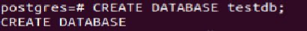
### зайдите в созданную базу данных под пользователем postgres
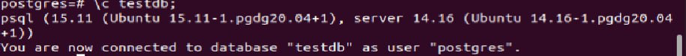
### создайте новую схему testnm
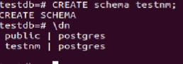
### создайте новую таблицу t1 с одной колонкой c1 типа integer
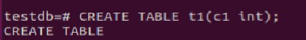
### вставьте строку со значением c1=1
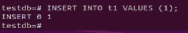
### создайте новую роль readonly дайте новой роли право на подключение к базе данных testdb
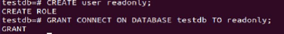
### дайте новой роли право на использование схемы testnm
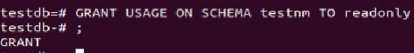
### дайте новой роли право на select для всех таблиц схемы testnm, создайте пользователя testread с паролем test123, дайте роль readonly пользователю testread, зайдите под пользователем testread в базу данных testdb, сделайте select * from t1;
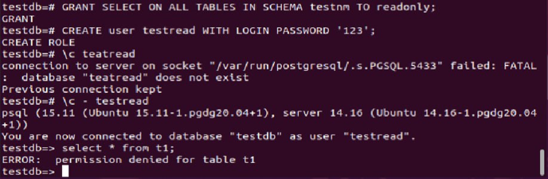
### получилось? (могло если вы делали сами не по шпаргалке и не упустили один существенный момент про который позже)
Нет, таблица в другой схеме
### вернитесь в базу данных testdb под пользователем postgres, удалите таблицу t1
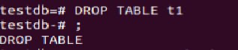
### создайте ее заново но уже с явным указанием имени схемы testnm
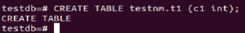
### вставьте строку со значением c1=1

### сделайте select * from testnm.t1;
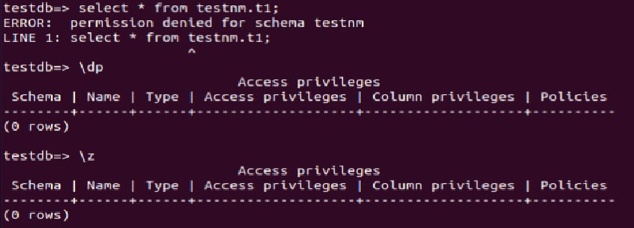
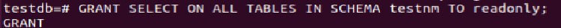
### сделайте select * from testnm.t1;
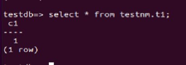
### теперь попробуйте выполнить команду create table t2(c1 integer); insert into t2 values (2);
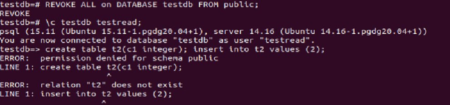

Делал давно, дальше скрины утеряны =( прошу зачесть как есть.