### Создать БД для тестов: выполнить pgbench -i postgres
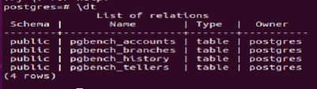
### Запустить pgbench -c8 -P 6 -T 60 -U postgres postgres
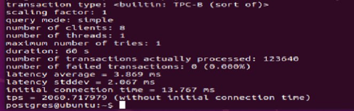
### Применить параметры настройки PostgreSQL из прикрепленного к материалам занятия файла
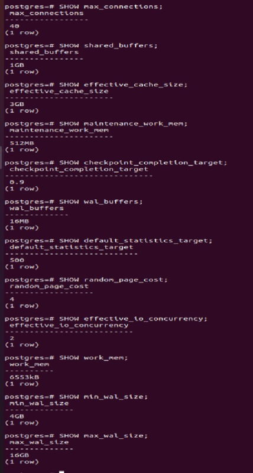
### Протестировать заново
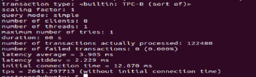
### Что изменилось и почему?
Особо ничего не поменялось, стало меньше tps 
### Создать таблицу с текстовым полем и заполнить случайными или сгенерированными данным в размере 1млн строк
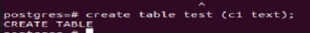
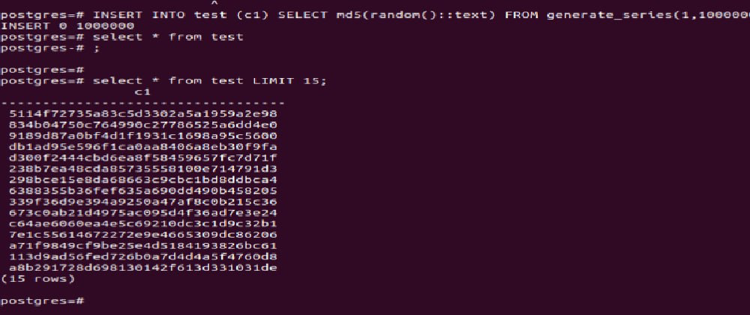
### Посмотреть размер файла с таблицей
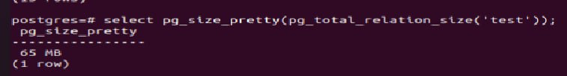
### 5 раз обновить все строчки и добавить к каждой строчке любой символ Посмотреть количество мертвых строчек в таблице и когда последний раз приходил автовакуум
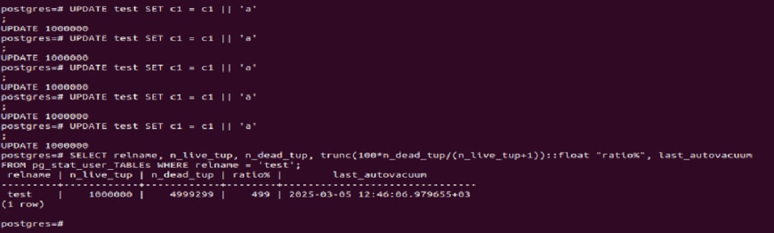
### Подождать некоторое время, проверяя, пришел ли автовакуум
### 5 раз обновить все строчки и добавить к каждой строчке любой символ
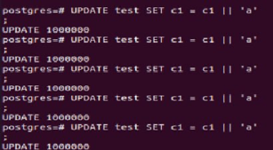
### Посмотреть размер файла с таблицей
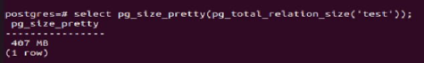
### Отключить Автовакуум на конкретной таблице 10 раз обновить все строчки и добавить к каждой строчке любой символ Посмотреть размер файла с таблицей
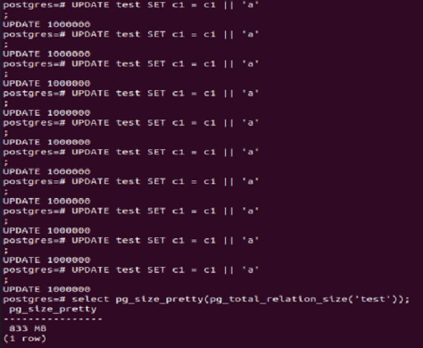 
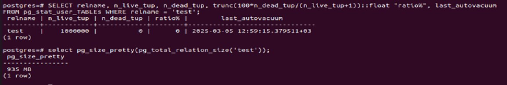
### Объясните полученный результат
Мертвые строки не удалются.