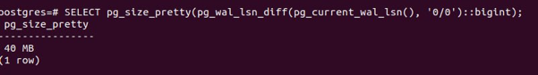
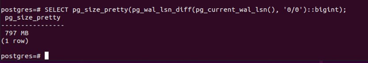
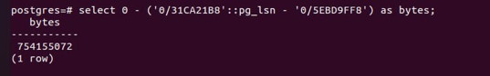
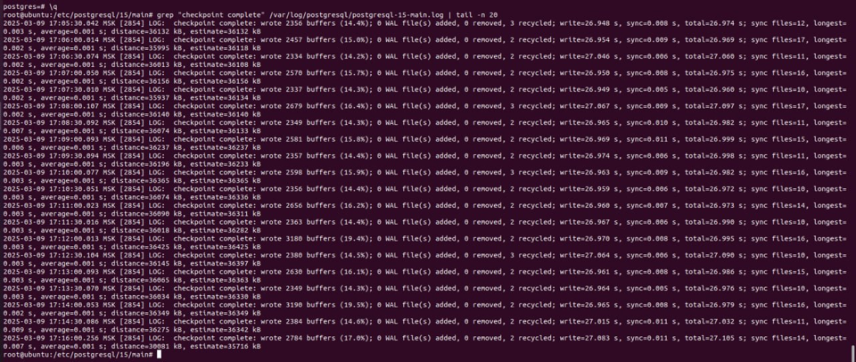
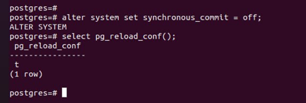
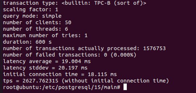

### Настройте выполнение контрольной точки раз в 30 секунд. 10 минут c помощью утилиты pgbench подавайте нагрузку. Измерьте, какой объем журнальных файлов был сгенерирован за это время. Оцените, какой объем приходится в среднем на одну контрольную точку.
 До
 После
 760/20 где-то 38 на точку
### Проверьте данные статистики: все ли контрольные точки выполнялись точно по расписанию. Почему так произошло?

### Сравните tps в синхронном/асинхронном режиме утилитой pgbench. Объясните полученный результат.

В асинхронном tps вырос, т.к. часть нагрузки ушла в асинхронный режим
