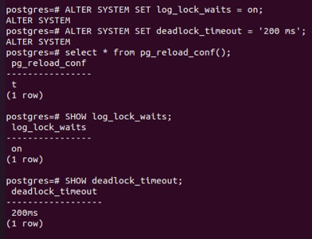
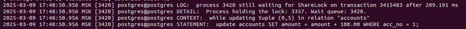
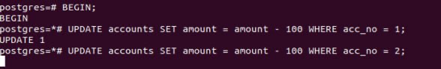
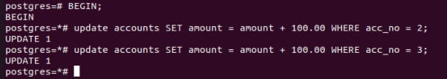
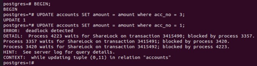
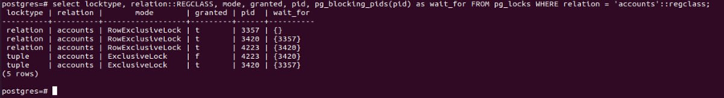
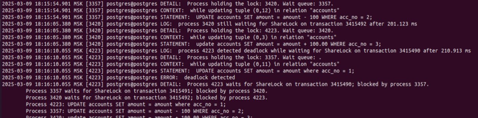

### Настройте сервер так, чтобы в журнал сообщений сбрасывалась информация о блокировках, удерживаемых более 200 миллисекунд. Воспроизведите ситуацию, при которой в журнале появятся такие сообщения.

### Смоделируйте ситуацию обновления одной и той же строки тремя командами UPDATE в разных сеансах. Изучите возникшие блокировки в представлении pg_locks и убедитесь, что все они понятны. Пришлите список блокировок и объясните, что значит каждая.

Блокировки понятны
3 блокировки от 3 транзакций, та что никого не ждет, это та которая поменяла
2 блокитровки строк от UPDATE
### Воспроизведите взаимоблокировку трех транзакций. Можно ли разобраться в ситуации постфактум, изучая журнал сообщений?

Можно уидить что дедлок возник когда процесс 3357 попытался наложить блокировку, хотя его ждет 3420 которого ждет 4223
### Могут ли две транзакции, выполняющие единственную команду UPDATE одной и той же таблицы (без where), заблокировать друг друга?
Если запустить апдейты построчные апдейты с разных концов таблицы?