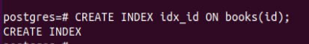
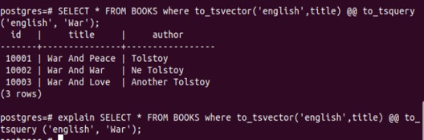
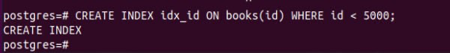
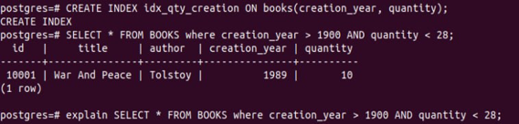

### Создать индекс к какой-либо из таблиц вашей БД

### Прислать текстом результат команды explain,в которой используется данный индекс
```
QUERY PLAN
------------------------------------------------------------------------
Index Scan using idx_id on books  (cost=0.29..45.77 rows=999 width=70)
Index Cond: (id < 1000)
(2 rows)
```
### Реализовать индекс для полнотекстового поиска

```
--------------------------------------------------------------------------------------
 Bitmap Heap Scan on books  (cost=12.39..120.18 rows=50 width=70)
   Recheck Cond: (to_tsvector('english'::regconfig, title) @@ '''war'''::tsquery)
   ->  Bitmap Index Scan on idx_text_title  (cost=0.00..12.38 rows=50 width=0)
         Index Cond: (to_tsvector('english'::regconfig, title) @@ '''war'''::tsquery)
(4 rows)
```
### Реализовать индекс на часть таблицы или индекс 

```
postgres=# explain select * from books where id < 6000;
                        QUERY PLAN                         
-----------------------------------------------------------
 Seq Scan on books  (cost=0.00..249.04 rows=6001 width=70)
   Filter: (id < 6000)
(2 rows)

postgres=# explain select * from books where id < 5000;
                                QUERY PLAN                                
--------------------------------------------------------------------------
 Index Scan using idx_id on books  (cost=0.28..204.28 rows=5000 width=70)
(1 row)
```
### Создать индекс на несколько полей

```
QUERY PLAN                                     
-----------------------------------------------------------------------------------
 Bitmap Heap Scan on books  (cost=49.90..190.57 rows=1111 width=86)
   Recheck Cond: ((creation_year > 1900) AND (quantity < 28))
   ->  Bitmap Index Scan on idx_qty_creation  (cost=0.00..49.62 rows=1111 width=0)
         Index Cond: ((creation_year > 1900) AND (quantity < 28))
(4 rows)
```

