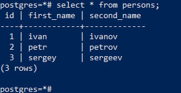

Часть с подключением к yc не стал вносить в отчет.

Синий экран - терминал powerShell, черный - другой сеанс обычный терминал windows.

### Посмотреть текущий уровень изоляции: show transaction isolation level

### В первой сессии добавить новую запись insert into persons(first_name, second_name) values('sergey', 'sergeev');

### Cделать select from persons во второй сессии. Видите ли вы новую запись и если да то почему?

Во второй сессии не виден insert, т.к. транзакция из первой сессии еще не завершена, а при уровне изоляции read committed, незакомиченные изменения не видны.

### Завершить первую транзакцию - commit;

### Сделать select from persons во второй сессии. Видите ли вы новую запись и если да то почему?

Изменения видны, т.к. закоммитили первую транзакцию.

### Начать новые но уже repeatable read транзации - set transaction isolation level repeatable read; В первой сессии добавить новую запись insert into persons(first_name, second_name) values('sveta', 'svetova');

### Сделать select* from persons во второй сессии; Видите ли вы новую запись и если да то почему?

Нет, т.к. на уровне изоляции repeatable read не видны незакомиченные изменения других транзакций.

### Завершить первую транзакцию - commit;

### Сделать select from persons во второй сессии. Видите ли вы новую запись и если да то почему?

Нет, т.к. при repeatable read не видны измения других транзакций, закомиченные после старта текущей.

### Завершить вторую транзакцию. Cделать select * from persons во второй сессии. Видите ли вы новую запись и если да то почему?

Измения видны, т.к. транзакция кончилась, теперь мы видим текущее состояние.
