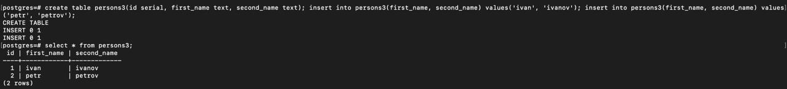

### Развернуть контейнер с PostgreSQL 15 смонтировав в него /var/lib/postgresql

### Развернуть контейнер с клиентом postgres

### Подключится из контейнера с клиентом к контейнеру с сервером и сделать таблицу с парой строк

### Подключится к контейнеру с сервером с ноутбука/компьютера извне инстансов ЯО/места установки докера

### Удалить контейнер с сервером. Cоздать его заново. Подключится снова из контейнера с клиентом к контейнеру с сервером

### Проверить, что данные остались на месте

