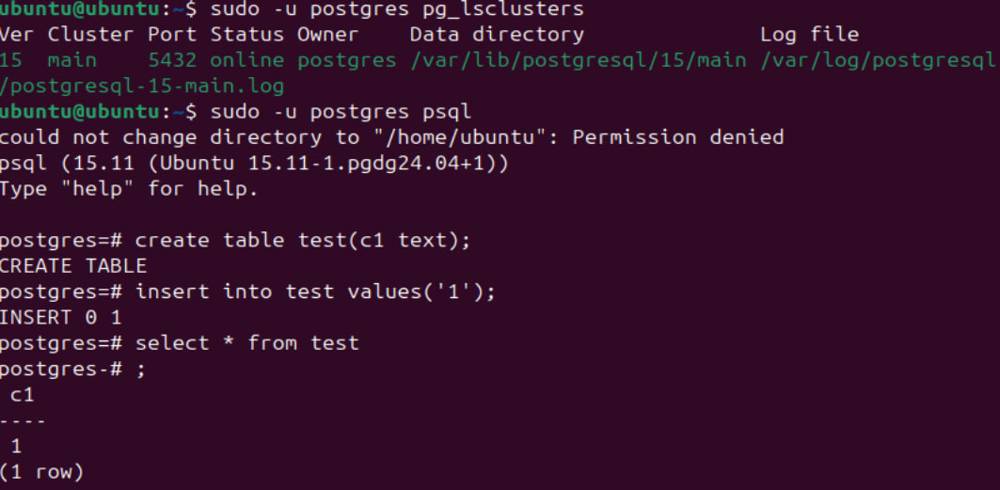
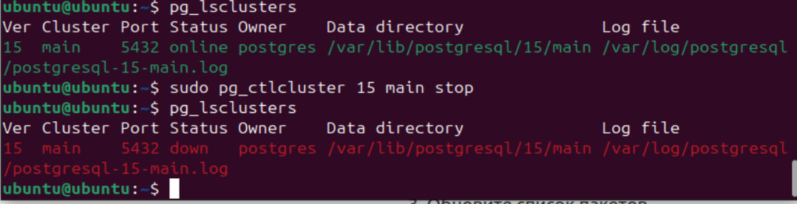
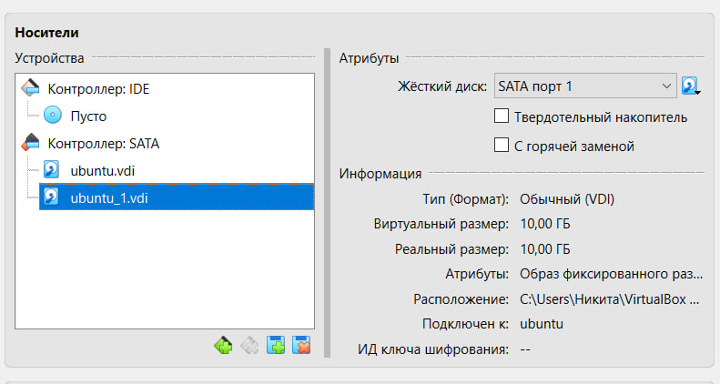
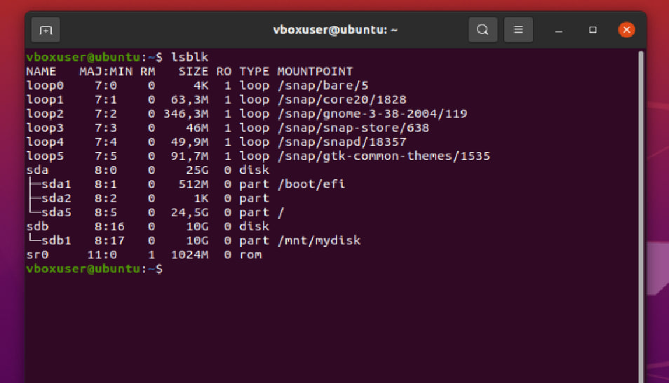
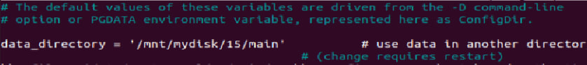
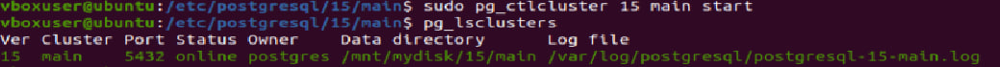
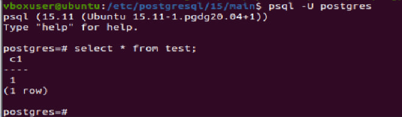

### Создайте виртуальную машину c Ubuntu 20.04/22.04 LTS в ЯО/Virtual Box/докере. Поставьте на нее PostgreSQL 15 через sudo apt. Проверьте что кластер запущен через sudo -u postgres pg_lsclusters. Зайдите из под пользователя postgres в psql и сделайте произвольную таблицу с произвольным содержимым postgres=# create table test(c1 text); postgres=# insert into test values('1');

### Остановите postgres например через sudo -u postgres pg_ctlcluster 15 main stop

### Coздайте новый диск к ВМ размером 10GB. Добавьте свеже-созданный диск к виртуальной машине - надо зайти в режим ее редактирования и дальше выбрать пункт attach existing disk

### Проинициализируйте диск согласно инструкции и подмонтировать файловую систему, только не забывайте менять имя диска на актуальное, в вашем случае это скорее всего будет /dev/sdb. Перезагрузите инстанс и убедитесь, что диск остается примонтированным (если не так смотрим в сторону fstab)

### Cделайте пользователя postgres владельцем /mnt/data - chown -R postgres:postgres /mnt/data/. Перенесите содержимое /var/lib/postgres/15 в /mnt/data - mv /var/lib/postgresql/15/mnt/data

### попытайтесь запустить кластер - sudo -u postgres pg_ctlcluster 15 main start. Напишите получилось или нет и почему

Не получилось, т.к. в предыдущем шаге перенесли данные в другую директорию, а постгрес ищет по старому пути

### Задание: найти конфигурационный параметр в файлах раположенных в /etc/postgresql/15/main который надо поменять и поменяйте его

Поменял путь до данных, поставил такой, куда переносили пару шагов назад

### Попытайтесь запустить кластер - sudo -u postgres pg_ctlcluster 15 main start

Запустился, т.к. теперь путь корректный

### Зайдите через через psql и проверьте содержимое ранее созданной таблицы

